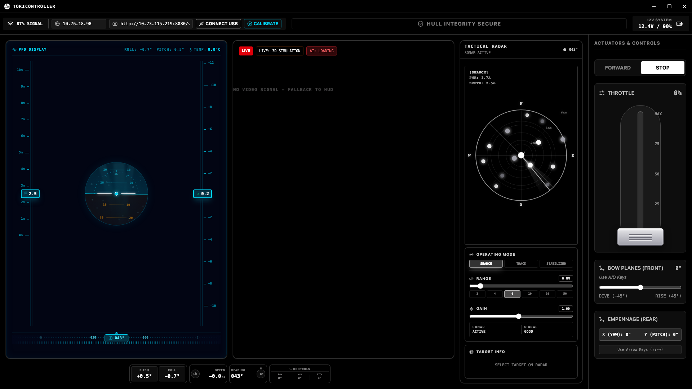

# 🌐 ToriController 2.0

> Next-Generation Robotic Submarine Control Dashboard & Pilot Telemetry Station.

ToriController 2.0 is an advanced, high-tech desktop control interface built with **Electron**, **React**, **Vite**, and **Tailwind CSS**. It is designed to act as the primary ground-station pilot terminal for custom autonomous/remotely operated underwater vehicles (ROVs/Submarines). The station establishes dual-redundant communication links via low-latency **USB Serial (Web Serial API)** or **Local WiFi (HTTP/WebSocket)** to monitor telemetry, map surroundings using sonar sweeps, and direct actuators in real time.

---

## 📸 Dashboard Interface



---

## ✨ Core Features

*   **⚡ Primary Flight Display (PFD):** Canvas-based artificial horizon indicating real-time submarine **Pitch**, **Roll**, and **Heading (Yaw)**. Includes vertical indicator tapes for tracking depth relative to limits.
*   **📡 Tactical Sonar Radar:** A sweeping polar radar interface visualizing surrounding target vectors, complete with adjustable gain, multi-range sweeps (2m - 50m), and operating modes (*Search*, *Track*, *Stabilized*).
*   **🤖 TensorFlow AI Target Tracking:** Integrated **TensorFlow.js (COCO-SSD)** engine capable of analyzing live camera streams to detect, outline, and track targets (marine life, divers, obstacles) autonomously.
*   **🩺 Diagnostics & Telemetry Gauges:** Real-time health monitoring including depth (m), ESC current draw (Amps), motor RPM, and internal motherboard temperature. Includes automatic warning thresholds for cavitation risk, motor stalls, and overheating.
*   **🔌 Dual Connection Link:** Dual-routed command transmitter utilizing the **Web Serial API** for direct tethered USB communication (e.g., CH340, CP210x, ESP32 USB) or asynchronous WiFi fetch requests when untethered.
*   **🔧 Sensor Calibration:** Guided IMU/gyroscope 10-second calibration routine to establish zero-relative pitch, roll, and yaw angles relative to flat levels.

---

## ⌨️ Pilot Key Bindings

Pilots can maneuver the submarine using standard keyboard shortcuts:

| Key Binding | Action / Command | Submarine Actuator Response |
| :--- | :--- | :--- |
| **`W`** | Speed Up / Accelerate | Increments throttle limit / sets forward drive direction. |
| **`S`** | Speed Down / Decelerate | Decrements throttle limit (stops when throttle hits `0`). |
| **`A`** | Steer Port (Left) | Synchronizes front bow planes and rear rudders for a left turn. |
| **`D`** | Steer Starboard (Right) | Synchronizes front bow planes and rear rudders for a right turn. |
| **`ArrowUp`** | Empennage Pitch Up | Deflects rear elevator fins upward to rise. |
| **`ArrowDown`** | Empennage Pitch Down | Deflects rear elevator fins downward to dive. |
| **`ArrowLeft`** | Empennage Yaw Left | Angles rear vertical rudder left. |
| **`ArrowRight`** | Empennage Yaw Right | Angles rear vertical rudder right. |
| **`Spacebar`** | **EMERGENCY STOP** | Neutralizes thrusters, centers all fins, and stops movement. |

---

## 📡 Serial Communication Protocol

ToriController communicates with onboard MCUs (such as ESP32 or Arduino) using a structured ASCII-based line-terminated protocol over 115200 baud rate.

### 1. Control Commands (Outgoing to Submarine)
Commands are appended with `\r\n` line endings.

*   **Thruster Control:** 
    *   `DIR:FWD` — Set rotation direction to Forward.
    *   `DIR:REV` — Set rotation direction to Reverse.
    *   `STOP` — Stop thrusters completely.
    *   `SPD:<0-255>` — Set thruster motor speed using 8-bit PWM (e.g., `SPD:128`).
*   **Servo Control:**
    *   `F_SRV:<angle>` — Set Bow Plane (Front Fin) angle. Center is `97` (e.g., `F_SRV:117` or `F_SRV:77`).
    *   `B_SRV:<angle>` — Set Rudder (Back Fin X-axis) angle. Center is `97`.

### 2. Telemetry Sentences (Incoming to Dashboard)
Onboard systems stream sensor sentences as line-terminated text:

*   **IMU Telemetry:** `IMU:<pitch>,<roll>,<yaw>`
    *   *Example:* `IMU:0.5,-1.2,43.2`
*   **Internal Temperature:** `TMP:<temp_celsius>` or `TEMP OF THE MAIN BOARD:<temp> °C`
    *   *Example:* `TMP:32.4`
*   **GPS Sentences:** `GPS: <lat>,<lng>` and `GPS_SAT: <satellite_count>`
    *   *Example:* `GPS: 23.8103,90.4125` / `GPS_SAT: 8`
    *   *Fault state:* `GPS: WIRING_ERROR` will trigger an alert on the panel diagnostics layout.

---

## 📂 Project Architecture

```markdown
├── electron/
│   ├── main.cjs        # Main Electron process (frame actions, Web Serial permissions)
│   └── preload.js      # Context isolation bridge exposing minimize/maximize/close actions
├── public/
│   └── ToriController.png  # High-resolution application preview screenshot
├── src/
│   ├── components/
│   │   ├── SubmarineDashboard.jsx   # Top-level state coordinator and serial loop
│   │   ├── PrimaryFlightDisplay.jsx # Attitude and horizon visualization canvas
│   │   ├── AdvancedRadarNavigation.jsx # Sonar polar sweeps and target overlays
│   │   ├── ControlPanel.jsx         # Joystick and manual slide actuators
│   │   ├── TelemetryPanel.jsx       # Real-time health gauges and warnings
│   │   └── TitleBar.jsx             # Frameless styling header with platform buttons
│   ├── App.jsx                      # App shell wrapping components
│   ├── main.jsx                     # Entrypoint
│   └── index.css                    # Design system and tailwind rules
└── package.json                     # Scripts and dependencies (lucide, tensorflow, electron)
```

---

## 🛠️ Installation & Getting Started

### 📋 Prerequisites
*   [Node.js](https://nodejs.org/) (v18.x or later recommended)
*   [npm](https://www.npmjs.com/)

### 🚀 Running the App
1.  **Clone the repository:**
    ```bash
    git clone https://github.com/your-username/ToriController-2.0.git
    cd ToriController-2.0
    ```
2.  **Install dependencies:**
    ```bash
    npm install
    ```
3.  **Run Development Mode (Electron + Vite):**
    This command boots the Vite local server and concurrently launches the desktop Electron container, automatically establishing connection permissions.
    ```bash
    npm run start
    ```
4.  **Run Web-Only Mode (Browser Development):**
    ```bash
    npm run dev
    ```

### 📦 Production Build & Packaging
To compile the React production code and pack the app into a native desktop installer (`.dmg` on macOS, `.exe` on Windows, or `.AppImage` on Linux):
```bash
npm run dist
```
Build outputs will be generated inside the `dist-electron` folder.

---

## 🛡️ License
Distributed under the MIT License. See `LICENSE` for more information.